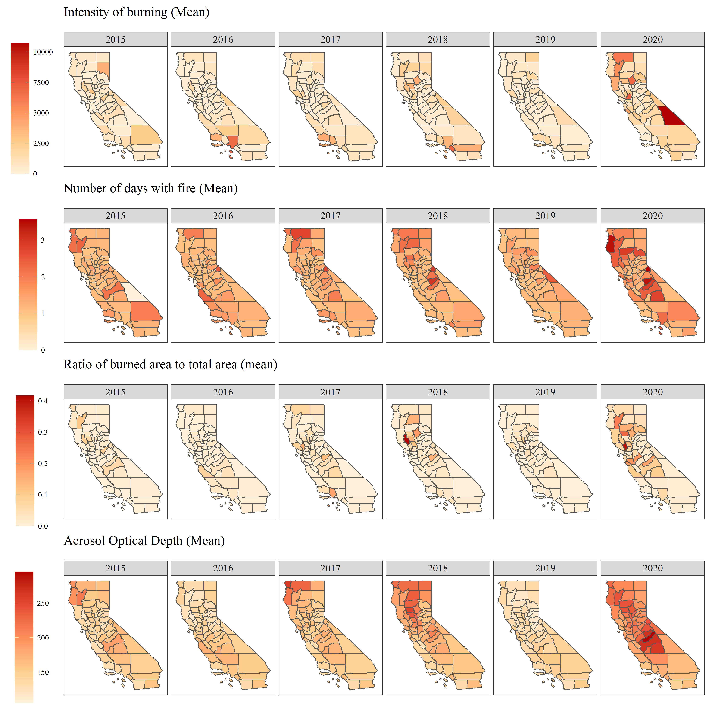

## Predicting County-level Asthma ED Rates in California using Google Earth Engine

This repository contains data and scripts used for the final project of [GEOG 567- Introduction to Remote Sensing](https://catalog.unc.edu/courses/geog/), at the University of North Carolina at Chapel Hill  

### Objectives
The state of California in the western United States has experienced increasingly severe drought conditions, and more frequent, severe (acute) wildfires. For the purposes of this analysis, we aim to examine the potential for remote sensing data to improve predictive models for Asthma-related Emergency Department admission rates at the county-level in California.
---
## Project structure 

  - `./scripts/` contains all the scripts needed to reproduce the analysis. The scripts are intended to be run in order of their number.
  - `./source_data/` contains publicly-available data used in the analytic pipeline.
  - `./figures/` contains all the original source visualizations, and processed visualizations that result from the `./scripts/` pipeline.
  - `./derived_data/` contains all processed data that results from our `./scripts/` pipeline.
---

### Notes

**Issues**

Please report issues to the [issues page](https://github.com/abhatia08/geog567-fall22/issues).

---
## Authors

- [Abhishek Bhatia](https://abhatia.me/) (: [abhatia08](https://github.com/abhatia08)) 

- [Julia Cardwell](https://tarheels.live/juliacardwell/) (: [jucardwell](https://github.com/jucardwell)) 
  
- [Amy Tran](https://github.com/amyltran) (: [amyltran](https://github.com/amyltran)) 
